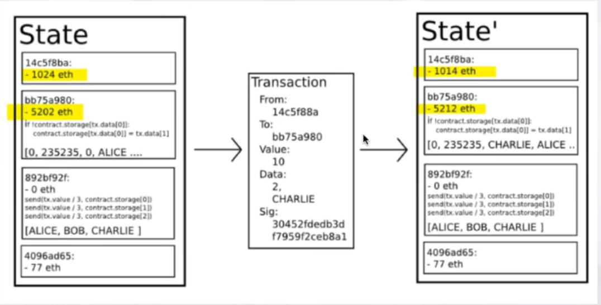

# Sample Hardhat Project

This project demonstrates a basic Hardhat use case. It comes with a sample contract, a test for that contract, and a script that deploys that contract.

Try running some of the following tasks:

```shell
npx hardhat help
npx hardhat test
REPORT_GAS=true npx hardhat test
npx hardhat node
npx hardhat compile
npx hardhat run scripts/deploy.ts
```

# 以太坊笔记：

以太坊通过建立终极的抽象的基础层-内置有图灵完备编程语言的区块链-使得任何人都能够创建合约和去中心化应用，并在其中设立他们自由定义的所有权规则、交易方式和状态转换函数。
以太坊虚拟机（EVM）是以太坊中智能合约的运行环境。它不仅被沙箱封装起来，事实上它被完全隔离，也就是说运行在EVM内部的代码不能接触到网络、文件系统或者其他进程。甚至智能与其他智能合约只有有限接触。

## 以太坊账户

包含四个部分：

- 随机数，用于确定每笔交易只能被处理一次的计数器，参与生成交易id
- 账户目前的以太币余额，以太币（Ether）是以太坊内部的主要加密燃料，用于支付交易费用。以太币最小单位Wei，最大单位以太，1Ether=10^18Wei
- 账户的合约代码
- 账户的存储,默认为空

## 以太坊的问题

- 高耗能（挖矿机制）
- 小额交易成本高（交易费用）
- 隐私性（完全公开）
- 并发处理能力差（每秒10～20笔交易）

## 交易

外部账户发送交易，交易包含以下内容：

- 消息的接收者地址
- 用于确认发送者的签名
- 要发送的以太币的数量
- 可选的数据（合约参数）
- GasLimit：用来限制合约最多执行多少次运算（每5个Byte需要1个Gas，防止死循环-交易费用=GasLimit\*GasPrice）
- GasPrice：每次计算需要支付的费用（对计算资源、存储资源、带宽的消耗都用Gas支付）

智能合约考虑资源消耗

## 消息

调用合约的CALL方法时隐式生成

消息包含五个部分：

- 消息的发送者
- 消息的接收者
- 要发送的以太币数量
- 可选的数据（合约参数）
- GasLimit：用来限制合约最多执行多少次运算

## 以太坊状态转移



以太坊的状态转换函数:APPLY(S,TX)->S’，定义如下：

1. 检查交易的格式是否正确(即有正确数值)、签名是否有效和随机数是否与发送者账户的随机数匹配。如否，返回错误。
2. 计算交易费用:fee=GasLimit \* GasPrice,并从签名中确定发送者的地址。从发送者的账户中减去交易费用和增加发送者的随机数。如果账户余额不足，返回错误。
3. 设定初值GAS =GasLimit,并根据交易中的字节数减去一定量的燃料值.
4. 从发送者的账户转移价值到接收者账户。如果接收账户还不存在，创建此账户。如果接收账户是一个合约，运行合约的代码，直到代码运行结束或者燃料用完。
5. 如果因为发送者账户足够的钱或者代码执行耗尽燃料导致价值转移失败，生成out-of-gas异常，恢复原来的状态，但是还需要支没有付交易费用，交易费用加至矿工账户。

区块链不可能三角：速度、安全性、去中心化，目前只能尽可能满足其中两项
